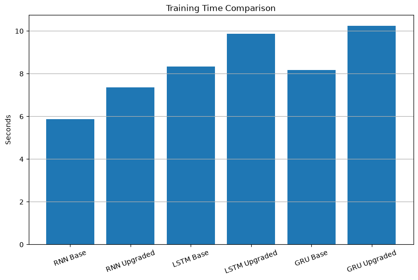

# 📖 Text Generation using Vanilla RNN, LSTM, and GRU

> A Deep Learning project that compares Vanilla RNN, LSTM, and GRU for next-word prediction and text generation using Shakespeare's works.


---

## 📌 Project Overview

Text generation is a fundamental Natural Language Processing (NLP) task where a model learns the structure, grammar, and contextual relationships within a text corpus to generate meaningful sequences.

This project compares three popular Recurrent Neural Network architectures:

- Vanilla RNN
- Long Short-Term Memory (LSTM)
- Gated Recurrent Unit (GRU)

Each architecture was trained on the same Shakespeare corpus under identical conditions to analyze their learning capability, memory handling, convergence behavior, and generated text quality.

---

## 🎯 Objectives

- Learn text representation using Tokenization
- Generate training sequences using N-grams
- Implement Vanilla RNN, LSTM, and GRU
- Compare baseline and upgraded architectures
- Analyze training and validation performance
- Evaluate generated text quality
- Compare computational efficiency

---

## 📂 Dataset

**Dataset:** Shakespeare Text Corpus

Source:
https://storage.googleapis.com/download.tensorflow.org/data/shakespeare.txt

Dataset used in this project:

- First **800 lines**
- Vocabulary Size: **1543 words**
- Training Samples: **4825 sequences**

---

## ⚙️ Technologies Used

- Python
- TensorFlow / Keras
- NumPy
- Pandas
- Matplotlib
- Scikit-learn

---

## 📊 Data Preprocessing

The following preprocessing pipeline was applied:

- Lowercase conversion
- Tokenization
- Integer Encoding
- N-gram Sequence Generation
- Sequence Padding
- Train-Validation Split (80:20)

---

## 🧠 Model Architectures

Six models were trained.

### Baseline Models

- Vanilla RNN
  - Embedding = 32
  - Hidden Units = 64
  - Epochs = 100

- LSTM
  - Embedding = 32
  - Hidden Units = 64
  - Epochs = 100

- GRU
  - Embedding = 32
  - Hidden Units = 64
  - Epochs = 100

### Upgraded Models

- Vanilla RNN
  - Embedding = 64
  - Hidden Units = 128
  - Epochs = 200

- LSTM
  - Embedding = 64
  - Hidden Units = 128
  - Epochs = 200

- GRU
  - Embedding = 64
  - Hidden Units = 128
  - Epochs = 200

---

## 🚀 Features Implemented

✅ Real Shakespeare Dataset

✅ Train / Validation Split

✅ Vanilla RNN

✅ LSTM

✅ GRU

✅ Baseline vs Upgraded Models

✅ EarlyStopping

✅ ModelCheckpoint

✅ Training Time Measurement

✅ Loss Comparison

✅ Accuracy Comparison

✅ Perplexity Calculation

✅ Parameter Count Comparison

✅ Memory Footprint Analysis

✅ Greedy (Argmax) Text Generation

✅ Temperature Sampling

✅ Generated Text Quality Evaluation

✅ CSV Export of Experimental Results

---

## 📈 Evaluation Metrics

The models were evaluated using:

- Training Loss
- Validation Loss
- Training Accuracy
- Validation Accuracy
- Perplexity
- Number of Parameters
- Memory Usage
- Training Time
- Generated Text Quality
- Unique Word Ratio
- Repetition Rate
- Average Word Length

---

## 📊 Experimental Results

| Model | Validation Accuracy | Validation Loss | Perplexity |
|------|----------------:|---------------:|-----------:|
| RNN Base | 5.80% | 6.8915 | 983.88 |
| RNN Upgraded | 5.39% | 6.9535 | 1046.83 |
| LSTM Base | 4.56% | 6.9903 | 1086.01 |
| LSTM Upgraded | 4.87% | 7.1157 | 1231.14 |
| GRU Base | 4.97% | 7.0385 | 1139.72 |
| **GRU Upgraded** | **6.11%** | 7.1182 | 1234.19 |

---

## 📷 Visualizations

The notebook includes:

- Training Loss Curves
- Validation Loss Curves
- Training Accuracy Curves
- Validation Accuracy Curves
- Training Time Comparison
- Parameter Comparison
- Generated Text Quality Analysis

> *(Add screenshots inside the `images/` folder and display them here.)*

Example:

```markdown



```

---

## ✍️ Sample Generated Text

### Argmax Decoding

```
thou art the the the the the the...
```

### Temperature Sampling

```
thou art clubs general's garners a done themselves say select work's...
```

Temperature sampling generated more diverse text than greedy decoding.

---

## 📁 Repository Structure

```
Text-Generation-RNN-LSTM-GRU/
│
├── notebook.ipynb
├── README.md
├── requirements.txt
├── model_comparison_results.csv
├── generated_text_evaluation.csv
├── images/
├── models/
└── report.pdf
```

---

## 🔍 Key Observations

- Vanilla RNN converged faster but struggled with repetitive text generation.
- LSTM improved contextual understanding through gated memory.
- GRU achieved the highest validation accuracy while maintaining computational efficiency.
- Temperature sampling produced more diverse text compared to greedy decoding.
- Increasing embedding dimensions and hidden units improved training performance but also increased computational cost.

---

## 🚀 Future Improvements

- Train on the complete Shakespeare corpus
- Implement Beam Search
- Implement Top-k Sampling
- Implement Nucleus (Top-p) Sampling
- Use Pre-trained Word Embeddings
- Compare with Transformer-based models (GPT)

---

## 📜 Conclusion

This project demonstrates the implementation and comparison of three recurrent neural network architectures for text generation.

Experimental analysis shows the trade-off between model complexity, computational cost, and text generation quality. While Vanilla RNN serves as a simple baseline, gated architectures such as LSTM and GRU provide better handling of contextual dependencies and generate more coherent text.

The project also incorporates professional deep learning practices including EarlyStopping, ModelCheckpoint, validation-based evaluation, perplexity analysis, and comprehensive performance comparison.

---

## 👨‍💻 Author

**Siddharth Gupta**

B.Tech Computer Science (AI, ML & Robotics)

DIT University, Dehradun

GitHub: https://github.com/Siddharthg30

---

## ⭐ If you found this project useful, consider giving it a star!